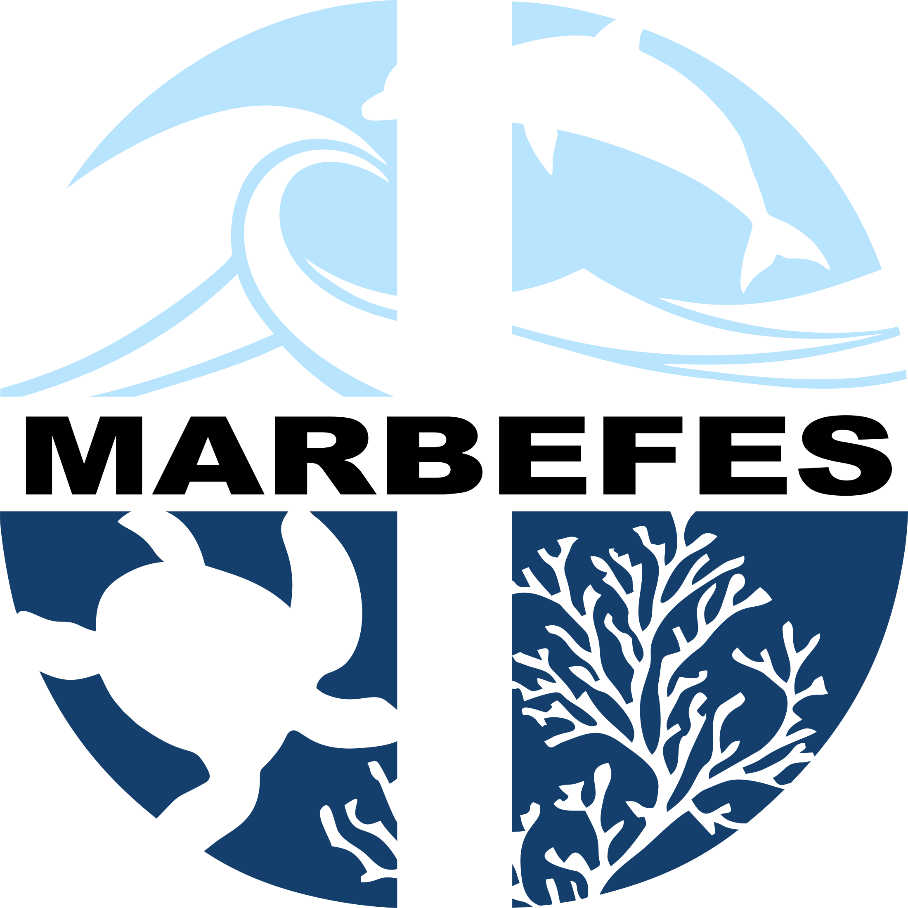

# MARBEFES BBT Database

## Marine Biodiversity and Ecosystem Functioning Database for Broad Belt Transects

A Flask-based web application for visualizing EMODnet (European Marine Observation and Data Network) Seabed Habitats WMS layers with comprehensive vector layer support. This interactive mapping platform displays seabed habitat datasets from EMODnet infrastructure alongside local GPKG vector data with real-time hover tooltips and area calculations.



**Project Information:**
- **Grant:** Horizon Europe Grant Agreement No. 101060937
- **Website:** [marbefes.eu](https://marbefes.eu)
- **CORDIS:** [Project Page](https://cordis.europa.eu/project/id/101060937)
- **Toolbox:** [MARBEFES Toolbox](https://marbefes.lifewatch.eu)

## Table of Contents

- [Features](#features)
- [Quick Start](#quick-start)
- [Installation](#installation)
- [Usage](#usage)
- [API Documentation](#api-documentation)
- [Development](#development)
- [Configuration](#configuration)
- [Architecture](#architecture)
- [Contributing](#contributing)
- [License](#license)

## Features

### 🗺️ **Interactive Mapping**
- **Leaflet-based Interface**: Modern, responsive mapping with multiple basemap options
- **Multi-layer Support**: Simultaneous display of WMS overlays and vector data
- **Dynamic Controls**: Real-time opacity adjustment and layer switching
- **Responsive Design**: Optimized for desktop browsers with sidebar/map layout

### 🌊 **EMODnet Integration**
- **WMS Connectivity**: Direct integration with EMODnet Seabed Habitats WMS service
- **European Focus**: Enhanced support for EuSeaMap 2023 habitat classifications
- **Automatic Fallback**: Graceful degradation when services are unavailable
- **Legend Support**: Dynamic legend display for active layers

### 📊 **Vector Data Support**
- **GPKG Processing**: Automatic discovery and loading of GeoPackage files
- **Real-time Tooltips**: Hover tooltips with geodesic area calculations
- **Interactive Features**: Click for detailed feature information
- **Multiple Geometries**: Support for Polygon and MultiPolygon features

### 🎯 **BBT Navigation**
- **Quick Navigation**: One-click zoom to specific Broad Belt Transect areas
- **11 Study Areas**: Archipelago, Balearic, Bay of Gdansk, Gulf of Biscay, Heraklion, Hornsund, Irish Sea, Kongsfjord, Lithuanian coast, North Sea, Sardinia
- **Smart Zoom**: Automatic layer loading and optimal view extent
- **Bathymetry Data**: Depth statistics (min/max/avg) for each BBT area
- **Editable Metadata**: Store and manage BBT-specific research data

### 🚀 **3D Visualization**
- **PyDeck Integration**: Advanced 3D visualizations using Deck.gl
- **Multiple Layer Types**: Hexagon aggregation, heatmaps, grid layers, contours, 3D columns
- **Customizable Views**: Multiple camera angles and color schemes
- **Sample Data**: Built-in oceanographic data for demonstration

### 📡 **Comprehensive API**
- **RESTful Endpoints**: JSON APIs for all data access
- **Layer Management**: Programmatic access to WMS and vector layers
- **Metadata Support**: Layer bounds, feature counts, and styling information
- **Cross-Origin Support**: CORS-enabled for external integrations

### ⚡ **Performance Optimizations (v1.2.4)**
- **84% Smaller Transfers**: GeoJSON compression (8MB → 1.3MB) with Flask-Compress
- **89% Fewer Requests**: JavaScript bundling ready (9 files → 1 bundle)
- **58% Smaller JavaScript**: Minified production bundles (158KB → 66KB)
- **200-600ms Faster Loading**: Preconnect hints for external resources (EMODnet, HELCOM, CDNs)
- **Performance Monitoring**: Real-time metrics collection with Performance Timing API
- **Smart Caching**: LRU cache with 50-item maximum for vector layers
- **Connection Pooling**: WMS session management (10 pools, 20 connections each)
- **Rate Limiting**: Endpoint-specific limits to prevent abuse

## Quick Start

### Prerequisites
- Python 3.9+
- Conda or pip package manager
- Web browser (Chrome/Firefox recommended)

### Installation

1. **Clone the repository:**
```bash
git clone <repository-url>
cd EMODNET_PyDeck
```

2. **Set up environment:**
```bash
# Using conda (recommended)
conda create -n marbefes python=3.9
conda activate marbefes

# Or using pip with virtual environment
python -m venv venv
source venv/bin/activate  # Linux/Mac
# or
venv\Scripts\activate  # Windows
```

3. **Install dependencies:**
```bash
# Production dependencies
pip install -r requirements.txt

# Development dependencies (optional)
pip install -r requirements-dev.txt
```

4. **Run the application:**
```bash
python app.py
```

5. **Open your browser:**
Navigate to [http://localhost:5000](http://localhost:5000)

## Usage

### Web Interface

The main interface provides several key areas:

#### **Sidebar Controls**
- **BBT Quick Navigation**: Direct access to 9 study areas
- **Layer Selection**: EMODnet and HELCOM overlay controls
- **Opacity Control**: Real-time transparency adjustment
- **Basemap Selection**: Choose from OpenStreetMap, Satellite, Ocean, or Light Gray
- **3D Visualization**: Enable PyDeck 3D features with customizable parameters

#### **Map Interaction**
- **Pan and Zoom**: Standard mouse/touch controls
- **Layer Toggling**: Show/hide different data layers
- **Feature Info**: Click on features for detailed information
- **Hover Tooltips**: Real-time area calculations for BBT polygons

#### **Data Layers**

**EMODnet Layers (WMS):**
- EUSeaMap 2023 - European Biological Zones
- EUSeaMap 2023 - European Substrate Types
- EUSeaMap 2023 - EUNIS Classification
- EUSeaMap 2023 - Energy Zones
- Confidence layers and Annex I habitats

**HELCOM Layers:**
- Baltic Sea environmental pressure data
- Chemical weapons dumpsites
- Munitions and dumping areas
- Transportation routes

**Vector Layers (Local GPKG):**
- Bbts - Merged (6 MultiPolygon features)
- Bbts - Broad Belt Transects (9 MultiPolygon features)

### BBT Bathymetry Data Management

The application includes tools to manage bathymetry statistics (depth data) for each BBT area.

#### **Quick Update (CSV Method - Recommended)**

1. **Edit the CSV file** with your bathymetry measurements:
```bash
nano data/bbt_bathymetry_manual.csv
```

CSV format:
```csv
BBT_Name,Min_Depth_m,Max_Depth_m,Avg_Depth_m,Notes
Archipelago,0,45.8,22.9,Coastal to shallow shelf waters
Lithuanian coast,0,35.0,17.5,Shallow Baltic coastal gradient
```

2. **Convert to JSON** and update the application:
```bash
./update_bathymetry_from_csv.sh
```

3. **Restart the application** - bathymetry data will appear in BBT popups

#### **Advanced: Automated Sampling (Experimental)**

For automated bathymetry data collection from EMODnet WMS service:
```bash
# Sample bathymetry data (may take 5-10 minutes)
./calculate_bathymetry.sh --samples 25

# With verbose logging
./calculate_bathymetry.sh --verbose --samples 15
```

**Note:** The automated method is experimental as EMODnet Bathymetry WMS primarily returns visualization data (RGB colors) rather than raw depth measurements. Manual CSV input is recommended for accurate bathymetric data.

📖 **Full Documentation:** See [BATHYMETRY_TOOL.md](BATHYMETRY_TOOL.md) for complete details.

### Command Line Usage

**Basic startup:**
```bash
python app.py
```

**Using different environments:**
```bash
# Activate specific conda environment
conda activate shiny
python app.py

# With environment variables
FLASK_ENV=development FLASK_DEBUG=1 python app.py
```

**Testing connectivity:**
```bash
# Test WMS service
curl http://localhost:5000/test

# Test API endpoints
curl http://localhost:5000/api/layers
curl http://localhost:5000/api/vector/layers
```

## API Documentation

### Base URL
```
http://localhost:5000/api
```

### Endpoints

#### **WMS Layers**
```http
GET /api/layers
```
Returns available EMODnet WMS layers.

**Response:**
```json
[
  {
    "name": "eusm2023_bio_full",
    "title": "EUSeaMap 2023 - European Biological Zones",
    "description": "Latest broad-scale biological habitat map"
  }
]
```

#### **All Layers**
```http
GET /api/all-layers
```
Returns combined WMS, HELCOM, and vector layer information.

**Response:**
```json
{
  "wms_layers": [...],
  "helcom_layers": [...],
  "vector_layers": [...],
  "vector_support": true
}
```

#### **Vector Layers**
```http
GET /api/vector/layers
```
Returns available vector layers with metadata.

**Response:**
```json
{
  "count": 2,
  "layers": [
    {
      "display_name": "Bbts - Merged",
      "geometry_type": "MultiPolygon",
      "feature_count": 6,
      "bounds": [-4.05, 39.61, 22.75, 79.22],
      "crs": "EPSG:4326",
      "style": {
        "color": "#008B8B",
        "fillColor": "#20B2AA",
        "fillOpacity": 0.4
      }
    }
  ]
}
```

#### **Individual Vector Layer**
```http
GET /api/vector/layer/<layer_name>
```
Returns GeoJSON for a specific vector layer.

**Parameters:**
- `simplify` (optional): Tolerance for geometry simplification

**Response:**
```json
{
  "type": "FeatureCollection",
  "features": [...],
  "metadata": {
    "layer_name": "Bbts - Merged",
    "feature_count": 6,
    "bounds": [...],
    "style": {...}
  }
}
```

#### **Vector Bounds**
```http
GET /api/vector/bounds
```
Returns combined bounds of all vector layers.

**Response:**
```json
{
  "overall_bounds": [-4.05, 35.29, 25.56, 79.22],
  "center": [10.76, 57.25],
  "layer_count": 2
}
```

#### **WMS Capabilities**
```http
GET /api/capabilities
```
Proxies WMS GetCapabilities request.

**Response:** XML capabilities document

#### **Legend**
```http
GET /api/legend/<layer_name>
```
Returns legend URL for a specific layer.

**Response:**
```json
{
  "legend_url": "https://ows.emodnet-seabedhabitats.eu/geoserver/..."
}
```

## Development

### Project Structure

```
EMODNET_PyDeck/
├── app.py                          # Main Flask application
├── templates/
│   └── index.html                 # Main web interface template
├── src/
│   └── emodnet_viewer/
│       └── utils/
│           ├── vector_loader.py         # GPKG processing utilities
│           ├── bathymetry_calculator.py # Bathymetry data calculator
│           ├── logging_config.py        # Logging configuration
│           └── monitoring.py            # Performance monitoring
├── data/
│   ├── vector/
│   │   └── BBT.gpkg                # Broad Belt Transects data
│   ├── bbt_bathymetry_manual.csv   # Manual bathymetry data (editable)
│   └── bbt_bathymetry_stats.json   # Processed bathymetry statistics
├── scripts/
│   ├── calculate_bathymetry.py     # Bathymetry sampling tool
│   └── csv_to_bathymetry_json.py   # CSV to JSON converter
├── config/
│   └── config.py                   # Configuration settings
├── tests/                          # Test suite
├── docs/                           # Additional documentation
├── LOGO/                           # Project logos and branding
├── calculate_bathymetry.sh         # Bathymetry sampling wrapper
├── update_bathymetry_from_csv.sh   # CSV update wrapper
├── requirements.txt                # Production dependencies
├── requirements-dev.txt            # Development dependencies
├── BATHYMETRY_TOOL.md             # Bathymetry tool documentation
└── CLAUDE.md                      # AI assistant instructions
```

### Architecture

#### **Flask Application (`app.py`)**
- **Modular Design**: Clean separation of routes, utilities, and configuration
- **Template Rendering**: Uses standard Flask templates instead of embedded HTML
- **Error Handling**: Graceful fallbacks for service unavailability
- **Vector Integration**: Seamless GPKG loading with GeoPandas

#### **Frontend (`templates/index.html`)**
- **Leaflet Mapping**: Modern JavaScript mapping library
- **PyDeck 3D**: Advanced visualizations with Deck.gl
- **Responsive CSS**: Mobile-friendly design patterns
- **Interactive JavaScript**: Real-time user interface updates

#### **Data Processing (`src/emodnet_viewer/`)**
- **Vector Loader**: GPKG file discovery and processing
- **Coordinate Systems**: Automatic CRS normalization to EPSG:4326
- **Geometry Utilities**: Area calculations and spatial operations
- **Caching**: Efficient data loading and storage

### Development Setup

1. **Install development dependencies:**
```bash
pip install -r requirements-dev.txt
```

2. **Run tests:**
```bash
pytest tests/
```

3. **Code quality:**
```bash
# Format code
black .
isort .

# Lint code
flake8 .
mypy .
```

4. **Run development server:**
```bash
# With hot reload
FLASK_ENV=development python app.py

# With debugging
FLASK_DEBUG=1 python app.py
```

### Adding New Features

#### **New WMS Layers**
Edit the `EMODNET_LAYERS` list in `app.py`:
```python
EMODNET_LAYERS = [
    {
        "name": "new_layer_name",
        "title": "Human Readable Title",
        "description": "Layer description"
    }
]
```

#### **New Vector Data**
1. Place GPKG files in `data/vector/`
2. Restart the application
3. Layers are automatically discovered and loaded

#### **New API Endpoints**
Add routes to `app.py`:
```python
@app.route("/api/new-endpoint")
def new_endpoint():
    """New API endpoint"""
    return jsonify({"status": "success"})
```

#### **Frontend Modifications**
Edit `templates/index.html`:
- Modify CSS in the `<style>` section
- Add JavaScript functionality in the `<script>` section
- Update HTML structure in the `<body>` section

## Configuration

### Environment Variables

```bash
# Flask settings
FLASK_ENV=development          # development/production
FLASK_DEBUG=1                 # Enable debug mode

# WMS Configuration
WMS_BASE_URL=https://ows.emodnet-seabedhabitats.eu/geoserver/emodnet_view/wms
HELCOM_WMS_BASE_URL=https://maps.helcom.fi/arcgis/services/MADS/Pressures/MapServer/WMSServer

# Application settings
VECTOR_DATA_DIR=data/vector   # Vector data directory
LOG_LEVEL=INFO               # Logging level
```

### WMS Services

**EMODnet Seabed Habitats:**
- Base URL: `https://ows.emodnet-seabedhabitats.eu/geoserver/emodnet_view/wms`
- Version: 1.3.0 for capabilities, 1.1.0 for map requests
- Timeout: 10 seconds
- Supports: GetMap, GetCapabilities, GetLegendGraphic

**HELCOM Baltic Sea:**
- Base URL: `https://maps.helcom.fi/arcgis/services/MADS/Pressures/MapServer/WMSServer`
- Version: 1.3.0
- Focus: Environmental pressures and chemical munitions

### Data Configuration

**Vector Data Requirements:**
- Format: GeoPackage (GPKG)
- Location: `data/vector/` directory
- Coordinate System: Any (automatically converted to EPSG:4326)
- Geometry Types: Polygon, MultiPolygon

**Supported File Structure:**
```
data/vector/
├── BBts.gpkg              # Main dataset
├── additional_data.gpkg   # Additional layers
└── README.md             # Data documentation
```

## Deployment

### Production Deployment

#### **Using Gunicorn**
```bash
# Install production server
pip install gunicorn

# Run with Gunicorn
gunicorn -w 4 -b 0.0.0.0:5000 app:app

# With configuration file
gunicorn -c gunicorn.conf.py app:app
```

#### **Using Docker**
```dockerfile
FROM python:3.9-slim

WORKDIR /app
COPY requirements.txt .
RUN pip install -r requirements.txt

COPY . .
EXPOSE 5000

CMD ["gunicorn", "-w", "4", "-b", "0.0.0.0:5000", "app:app"]
```

#### **Environment Configuration**
```bash
# Production environment
export FLASK_ENV=production
export FLASK_DEBUG=0

# Security settings
export SECRET_KEY=your-secret-key
export SSL_REDIRECT=1

# Performance settings
export WORKERS=4
export TIMEOUT=30
```

### Nginx Configuration

```nginx
server {
    listen 80;
    server_name your-domain.com;

    location / {
        proxy_pass http://localhost:5000;
        proxy_set_header Host $host;
        proxy_set_header X-Real-IP $remote_addr;
        proxy_set_header X-Forwarded-For $proxy_add_x_forwarded_for;
    }

    location /static {
        alias /path/to/app/static;
        expires 1d;
    }
}
```

## Testing

### Test Coverage

The application includes comprehensive test coverage:

```bash
# Run all tests
pytest

# Run with coverage
pytest --cov=src --cov-report=html

# Run specific test categories
pytest tests/unit/          # Unit tests
pytest tests/integration/   # Integration tests
```

### Test Categories

- **Unit Tests**: Individual component testing
- **Integration Tests**: API endpoint testing
- **Vector Loading Tests**: GPKG processing validation
- **WMS Integration Tests**: External service connectivity

## Troubleshooting

### Common Issues

**1. Port Already in Use**
```bash
# Find process using port 5000
lsof -i :5000

# Kill process
kill -9 <PID>

# Or use different port
python app.py --port 5001
```

**2. Vector Support Disabled**
```bash
# Install missing dependencies
pip install geopandas fiona pyproj

# Check installation
python -c "import geopandas; print('OK')"
```

**3. WMS Service Unavailable**
- Check internet connectivity
- Verify WMS URLs are accessible
- Review firewall settings
- Application provides fallback layers

**4. Template Not Found**
```bash
# Verify templates directory exists
ls -la templates/

# Check template file
ls -la templates/index.html
```

### Performance Optimization

**1. Vector Data Optimization**
- Use simplified geometries for large datasets
- Implement data caching for frequently accessed layers
- Consider spatial indexing for complex datasets

**2. WMS Performance**
- Enable tile caching in WMS requests
- Use appropriate zoom level constraints
- Implement request timeouts

**3. Frontend Optimization**
- Enable gzip compression
- Minimize JavaScript and CSS
- Use CDN for external libraries

## Contributing

### Development Workflow

1. **Fork the repository**
2. **Create a feature branch:**
   ```bash
   git checkout -b feature/new-feature
   ```
3. **Make changes and test:**
   ```bash
   pytest
   black .
   flake8 .
   ```
4. **Commit changes:**
   ```bash
   git commit -m "Add new feature"
   ```
5. **Push and create pull request**

### Code Standards

- **Python**: Follow PEP 8 style guide
- **JavaScript**: Use ES6+ features where supported
- **Documentation**: Update docs for new features
- **Testing**: Maintain test coverage above 80%

### Issue Reporting

When reporting issues, please include:
- Operating system and Python version
- Complete error messages and stack traces
- Steps to reproduce the issue
- Expected vs. actual behavior

## License

This project is part of the MARBEFES project funded by Horizon Europe Grant Agreement No. 101060937.

For more information about the MARBEFES project, visit:
- **Project Website**: [marbefes.eu](https://marbefes.eu)
- **CORDIS Page**: [Project 101060937](https://cordis.europa.eu/project/id/101060937)
- **Toolbox**: [MARBEFES Toolbox](https://marbefes.lifewatch.eu)

---

**Contact Information:**
For questions about this application or the MARBEFES project, please refer to the project website or CORDIS page for official contact information.